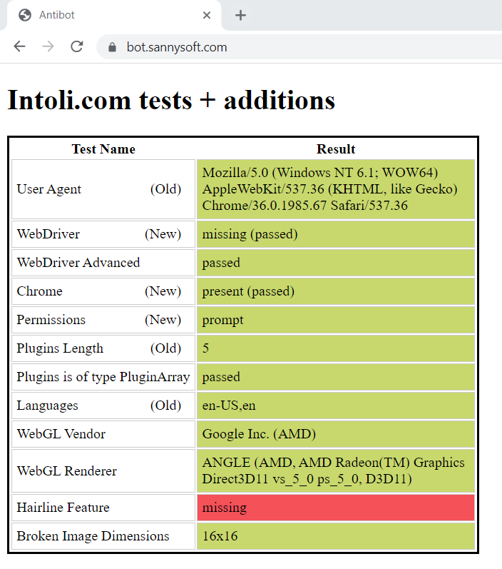

# Create Local Undetectable Chrome Driver (LUCD)

This program will download and patch a Chrome driver to make it undetectable. So that you can use an undetectable Chrome driver for your Python Selenium code.


## Passed the antibot test [](https://bot.sannysoft.com)



## What it does:

- Download the exact chrome driver based on your OS and installed chrome version.

- Remove browser control flag

- Remove signature in javascript

- Set User-Agent

- Use maximum resolution

- Open Chrome Instance on debugging mode

- Control an existing Chrome instance.

- Unmute the sounds of the browser.

- Save/ load Chrome profiles.

- Run Chrome driver on headless mode.

## Installation

```
$ pip install lucd 
```

or

```
$ pip install git+https://github.com/SelmiAbderrahim/CreateUndetectableChromeDriver
```

## Usage

```

from lucd.driver import Driver
driver = Driver()
chrome = driver.create_driver()

chrome.get("https://selmi.tech")

```


---


### Tests

Tested on:

        ✅ Windows

        ✅ Linux

        ❌ Mac

---

### [Documentation](https://selmi.tech/blog/post/lucd-how-to-create-undetectable-selenium-chrome-driver-python167977)
